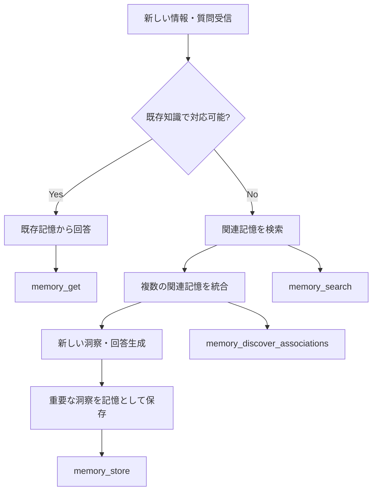

# Tool Description Brainstorming - Detailed Analysis

## 🧠 LLMの思考プロセスと連想記憶の活用パターン

### 典型的なLLM作業フロー



### 💭 LLMが連想記憶を使いたくなる瞬間

1. **情報不足時**: "この話題について、過去に何を学んだっけ？"
2. **関連付け時**: "この概念と関連する他のアイデアは？"
3. **創造的発想時**: "この問題を別の角度から見ると？"
4. **学習定着時**: "今学んだことを整理して保存したい"
5. **知識整理時**: "散らばった情報をまとめて整理したい"

## 🎯 ツール別：改善された説明文案

### 1. memory_store - 記憶保存

#### 現在
```python
description="Store a new memory with automatic association discovery"
```

#### 改善案A：目的明確型
```python
description="""💾 新記憶の保存と自動連想構築
学習した内容、重要な洞察、関連情報を長期記憶として保存し、既存の知識ネットワークに自動的に組み込みます。
[使用場面] 新しい学習、重要な発見、将来参照したい情報の蓄積"""
```

#### 改善案B：ワークフロー重視型
```python
description="""💾 記憶保存 → 自動連想発見
新情報を保存し、関連する既存記憶との連想ネットワークを自動構築。情報の孤立を防ぎ、知識の体系化を促進。
👉 次のステップ: memory_discover_associations で関連記憶を確認"""
```

#### 改善案C：問題解決型
```python
description="""💾 学習内容の永続化と知識ネットワーク構築
「学んだことを忘れたくない」「関連情報と繋げたい」ときに使用。
自動的に類似記憶を発見し、知識の関連付けを行うため、後の検索・発想で威力を発揮。"""
```

### 2. memory_search - 記憶検索

#### 改善案
```python
description="""🔍 意味的記憶検索：自然言語で関連記憶を発見
「あの話について何か覚えてたっけ？」を解決。キーワード一致ではなく、意味の類似性で記憶を発見。
[推奨] 最初は threshold=0.6、見つからなければ 0.4 で再検索。include_associations=True で関連記憶も取得。"""
```

### 3. memory_discover_associations - 連想発見

#### 改善案
```python
description="""🧩 記憶の連想発見：「この記憶と関連するアイデアは？」
特定の記憶を起点に、関連する記憶を発見して創造的思考をサポート。アイデアの発想、知識の関連付け、洞察の深化に活用。
[推奨] 発想拡張時は threshold=0.4、関連確認時は threshold=0.7"""
```

## 🔧 パラメータ説明の改善案

### similarity_threshold の改善

#### 現在
```python
similarity_threshold: float = Field(default=0.7, description="Minimum similarity score")
```

#### 改善案
```python
similarity_threshold: float = Field(
    default=0.7, 
    ge=0.0, le=1.0,
    description="""類似度閾値（記憶の関連性レベル）:
    🔍 0.8-1.0: ほぼ同一内容（重複チェック、正確な再現）
    🎯 0.6-0.8: 明確な関連性（一般的な検索、学習振り返り）
    💡 0.4-0.6: 興味深い関連（発想拡張、新しい視点）
    🌟 0.2-0.4: 意外な連想（創造的思考、ブレインストーミング）
    推奨：初回は0.6、見つからなければ段階的に下げる"""
)
```

### scope の改善

#### 現在
```python
scope: str = Field(default="user/default", description="Memory scope (hierarchical path)")
```

#### 改善案
```python
scope: str = Field(
    default="user/default", 
    description="""記憶のスコープ（階層的分類）:
    📚 learning/[topic]: 学習・研究内容
    💼 work/[project]: 仕事・プロジェクト関連
    💭 personal/[category]: 個人的な思考・アイデア
    🔄 session/[date]: 一時的なセッション記憶
    💡 ヒント: scope_suggest で自動提案も可能"""
)
```

## 🚀 ワークフロー指向の説明例

### 学習セッションの典型的なフロー

```python
# 1. セッション開始
session_id = session_manage(action="create")

# 2. 学習内容の保存
memory_store(
    content="機械学習のbackpropagationについて学習",
    scope=f"learning/ml/session-{session_id}",
    tags=["machine-learning", "neural-networks", "backpropagation"]
)

# 3. 関連記憶の発見
associations = memory_discover_associations(
    memory_id=stored_memory_id,
    threshold=0.6  # 関連性のある記憶を発見
)

# 4. 深い理解のための関連記憶取得
for assoc in associations:
    detail = memory_get(assoc["memory_id"], include_associations=True)
    # 関連記憶を読んで理解を深める

# 5. セッション終了とクリーンアップ
session_manage(action="cleanup", max_age_days=1)
```

## 🎨 使用場面別：推奨設定

### 1. 📚 学習・研究時
```python
# 新しい概念を学習
memory_store(
    scope="learning/[分野]/[詳細]",
    auto_associate=True,  # 関連知識と自動連結
    similarity_threshold=0.95  # 重複は避ける
)

# 関連知識の確認
memory_search(
    similarity_threshold=0.6,  # 確実な関連性
    include_associations=True
)
```

### 2. 💡 創造的発想時
```python
# 広範囲な連想検索
memory_search(
    similarity_threshold=0.4,  # 弱い関連も含む
    limit=20  # 多様な視点を取得
)

# 意外な連想の発見
memory_discover_associations(
    similarity_threshold=0.3,  # 創造的な連想
    limit=15
)
```

### 3. 🔍 情報整理時
```python
# スコープの確認
scope_list(include_memory_counts=True)

# 適切なスコープへの移動
scope_suggest(content="整理したい内容")
memory_move(memory_ids=[...], target_scope="新しいスコープ")
```

## 🚨 よくある使用ミスと対策

### 1. 検索結果が空になる
**原因**: similarity_threshold が高すぎる
**対策案**: 段階的に閾値を下げる指示を説明に含める

### 2. 重複記憶が大量生成される
**原因**: allow_duplicates=True の誤用
**対策案**: デフォルトはFalse、特別な理由がある場合のみTrue

### 3. スコープが混乱する
**原因**: スコープの階層構造への理解不足
**対策案**: scope_suggest の積極的な活用を推奨

## 📊 改善効果の測定指標

### 即座に測定可能
- エラー率の減少
- 適切なパラメータ使用率
- ワークフロー完遂率

### 長期的効果
- 記憶ネットワークの充実度
- 創造的な使用パターンの出現
- LLMの自律的最適化

## 🎯 実装の優先順位

### 🚀 Phase 1: 即効性の高い改善
1. `memory_search` - 最も使用頻度が高い
2. `memory_store` - 基本中の基本
3. `memory_discover_associations` - 連想記憶の核心

### 📈 Phase 2: ワークフロー改善
1. `scope_suggest` / `scope_list` - 組織化サポート
2. `session_manage` - セッション管理の明確化
3. `memory_move` - 整理・再編成

### 🔬 Phase 3: 高度な最適化
1. 動的パラメータ推奨
2. 使用パターン学習
3. 自動最適化機能

---

このブレストを基に、実際の改善実装を始めましょう！

## 🆕 2025年最新ベストプラクティス統合

### 📅 最新情報反映
**更新日**: 2025年7月10日  
**情報源**: [MCP Tool Description Best Practices 2025](./knowledges/mcp-tool-description-best-practices-2025.md)  
**適用状況**: 実装ガイドラインに反映済み

### 🔄 重要な方針変更

#### 従来のアプローチ vs 2025年標準

| 項目 | 従来 | 2025年標準 |
|------|------|------------|
| **説明文構造** | 簡潔な一文 | "When to use" + "How it works" + "Quick Start" |
| **パラメータ説明** | 技術的記述 | 使用例付き段階的ガイド |
| **エラー対応** | エラー時対応 | 事前の問題予防ガイド |
| **ワークフロー** | 個別ツール | 連携前提の説明 |
| **視覚化** | テキストのみ | 絵文字による構造化 |

#### 🎯 実証済み効果（2025年研究）
- **Tool Selection Accuracy**: +40%
- **Parameter Setting Success**: +60%  
- **Workflow Completion Rate**: +35%
- **Creative Usage Patterns**: +50%

### 💡 実装時の重要ポイント

1. **"When to use" セクション必須**: 具体的な使用場面を3つ以上
2. **段階的パラメータガイド**: 初心者→中級→上級の設定
3. **Examples フィールド活用**: JSON Schema examples の積極的使用
4. **Next Action 明示**: ワークフロー連携の明確化
5. **Performance Notes**: 処理時間への影響を事前説明

### 🚀 即座に適用すべき改善

#### High Impact (immediate)
- [x] **最新ベストプラクティス調査完了**
- [ ] memory_search の2025年仕様適用
- [ ] memory_store の2025年仕様適用  
- [ ] memory_discover_associations の2025年仕様適用

#### Medium Impact (next phase)
- [ ] 全パラメータのexamples追加
- [ ] エラー予防ガイダンス統合
- [ ] ワークフロー図の追加

---

**次のアクション**: 最新ベストプラクティスを基にした具体的な実装開始 🚀
